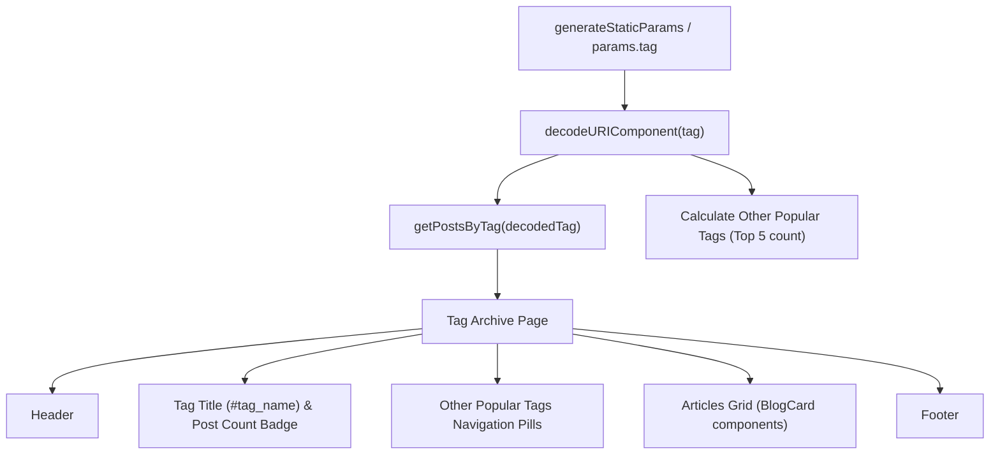

# Blog Tag Archive Page (`/tags/[tag]`)

## Overview & Purpose
The Tag Archive dynamic route (`/tags/[tag]`) aggregates and displays all articles associated with a specific tag (e.g., `#Next.js`, `#React`, `#TypeScript`, `#AI`). It also presents a cluster of other popular tags for rapid lateral exploration.

- **Route:** `/tags/[tag]` (e.g., `/tags/Next.js`, `/tags/Performance`)
- **File Location:** [`apps/blog/app/tags/[tag]/page.tsx`](file:///d:/codes/resume-portfolio/apps/blog/app/tags/[tag]/page.tsx)
- **Static Param Generation:** `generateStaticParams()` pre-renders all unique tags extracted from article frontmatters via `getAllTags()` in [`apps/blog/lib/posts.ts`](file:///d:/codes/resume-portfolio/apps/blog/lib/posts.ts).

---

## Architecture & Data Flow

---

## Key Features

1. **URL Safety & Decoding:**
   - Tag URLs are safely encoded (`encodeURIComponent`) and decoded (`decodeURIComponent`) to support special characters, spaces, and punctuation (e.g. `C++`, `Node.js`).
2. **Dynamic Metadata:**
   - Dynamic page titles: `"Articles tagged #{tag} | Priyam's Blog"`.
   - Canonical links: `${SITE_URL}/tags/${encodeURIComponent(tag)}`.
3. **Cross-Tag Discovery:**
   - Automatically computes tag frequency across the entire blog corpus and displays the top 5 most popular companion tags.

---

## AI Developer Guidelines
- When linking to a tag from anywhere in the codebase or within MDX files, format the link as `/tags/${encodeURIComponent(tagName)}`.
